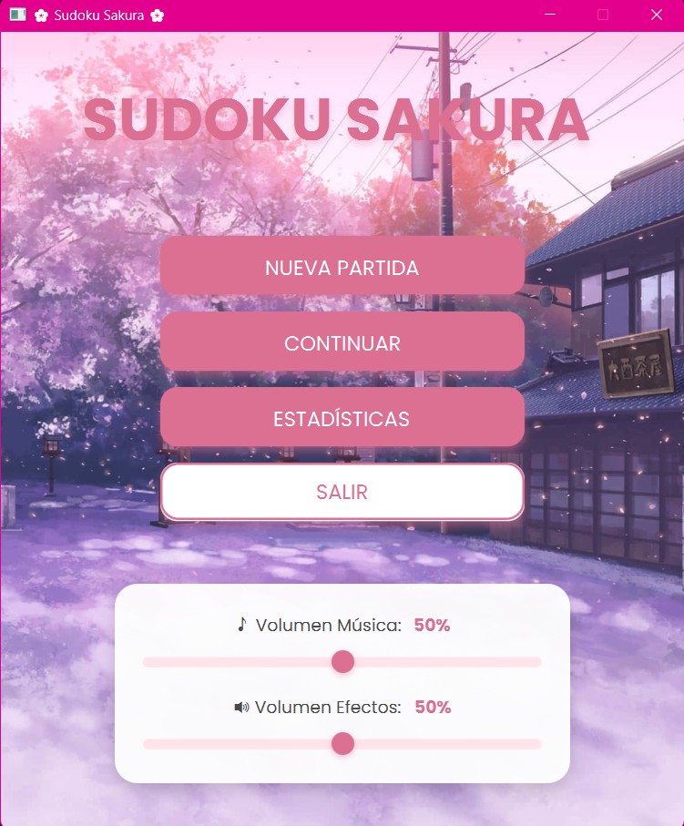
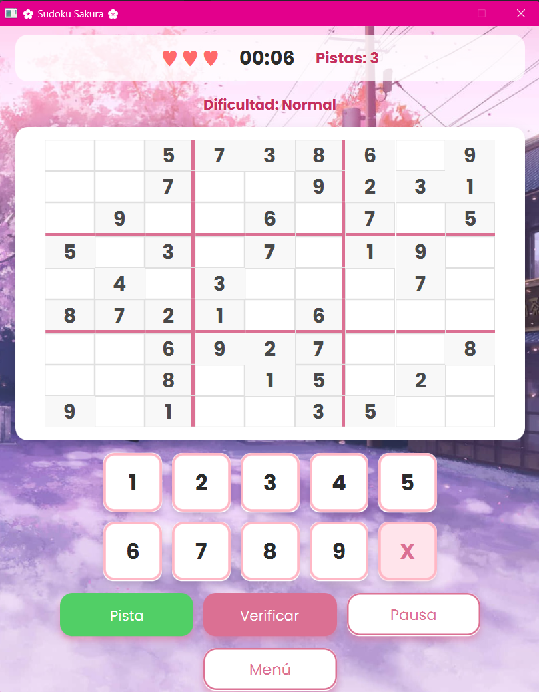

# 🌸 Sudoku Sakura

<div align="center">


**Sudoku clásico con temática japonesa y diseño moderno**

[Características](#-características) • [Instalación](#-instalación) • [Cómo Jugar](#-cómo-jugar) • [Tecnologías](#-tecnologías) • [Estructura](#-estructura-del-proyecto)

</div>

---

## 📖 Descripción

**Sudoku Sakura** es una implementación moderna y elegante del clásico juego de Sudoku, desarrollada en Java con JavaFX. El proyecto presenta un diseño visual inspirado en la estética japonesa de las flores de cerezo (sakura), con una interfaz intuitiva y características avanzadas como sistema de guardado, estadísticas detalladas y múltiples niveles de dificultad.

Este proyecto fue desarrollado como parte de mis estudios en **Desarrollo de Aplicaciones Multiplataforma (DAM)**, demostrando habilidades en:
-  Diseño de interfaces gráficas con JavaFX y CSS
-  Arquitectura MVC (Model-View-Controller)
-  Persistencia de datos mediante serialización
-  Integración multimedia (audio)
-  Algoritmos de generación y validación de Sudoku

---

## ✨ Características

### 🎮 Gameplay
-  **3 niveles de dificultad**: Fácil, Normal y Difícil
-  **Sistema de vidas**: 3 vidas por partida
-  **Sistema de pistas**: 3 pistas disponibles por partida
-  **Temporizador** para registrar tu tiempo
-  **Guardado automático**: Continúa donde lo dejaste
-  **Verificación de tablero** en cualquier momento

### 📊 Sistema de Estadísticas
-  Registro de partidas ganadas y perdidas
-  Mejores tiempos por dificultad
-  Tasa de éxito
-  Sistema de rachas
-  Contador de pistas usadas

### 🎨 Diseño Visual
-  **Tema Sakura**: Colores rosas pastel y estética japonesa
-  **Interfaz moderna**: Diseño limpio con efectos visuales
-  **Responsive**: Interfaz adaptable
-  **Animaciones suaves**: Transiciones y efectos hover
-  **Fondo personalizado** con imagen de flores de cerezo

### 🎵 Audio
-  **Música de fondo** configurable
-  **Efectos de sonido**: Click, pista, victoria, derrota, error
-  **Control de volumen** independiente para música y efectos
-  **Silencio opcional**: Sistema on/off

---

## 🖼️ Capturas de Pantalla


### Menú Principal


### Tablero de Juego


---

## 🛠️ Tecnologías

| Tecnología | Uso |
|------------|-----|
| **Java 17** | Lenguaje principal |
| **JavaFX 17** | Framework de interfaz gráfica |
| **CSS3** | Estilos personalizados |
| **Maven** | Gestión de dependencias |
| **Java Serialization** | Persistencia de datos |
| **JavaFX Media** | Sistema de audio |

### Dependencias Principales
```xml
<dependency>
    <groupId>org.openjfx</groupId>
    <artifactId>javafx-controls</artifactId>
    <version>17.0.1</version>
</dependency>
<dependency>
    <groupId>org.openjfx</groupId>
    <artifactId>javafx-fxml</artifactId>
    <version>17.0.1</version>
</dependency>
<dependency>
    <groupId>org.openjfx</groupId>
    <artifactId>javafx-media</artifactId>
    <version>17.0.1</version>
</dependency>
```

---

## 📦 Instalación

### Requisitos Previos
- **Java JDK 17** o superior
- **Maven** (opcional, para compilar desde código fuente)
- **JavaFX SDK 17** (si no usas Maven)

### Opción 1: Ejecutar JAR (Más fácil)
```bash
# Descarga el JAR desde releases
java -jar sudoku-sakura.jar
```

### Opción 2: Compilar desde código fuente
```bash
# Clonar el repositorio
git clone https://github.com/tu-usuario/sudoku-sakura.git
cd sudoku-sakura

# Compilar con Maven
mvn clean install

# Ejecutar
mvn javafx:run
```

### Opción 3: Desde IDE (IntelliJ IDEA / Eclipse)
1. Abre el proyecto en tu IDE
2. Asegúrate de tener Java 17 configurado
3. Descarga las dependencias de Maven
4. Ejecuta la clase `Main.java`

---

## 🎮 Cómo Jugar

### Controles Básicos
1. **Seleccionar celda**: Click en la celda vacía
2. **Colocar número**: Click en los botones 1-9
3. **Borrar número**: Click en el botón "X"
4. **Usar pista**: Click en botón "Pista" (máximo 3)
5. **Verificar tablero**: Click en "Verificar"
6. **Pausar**: Click en "Pausa"

### Reglas del Juego
- Completa el tablero 9x9 con números del 1 al 9
- Cada fila debe contener los números del 1 al 9 sin repetir
- Cada columna debe contener los números del 1 al 9 sin repetir
- Cada cuadro 3x3 debe contener los números del 1 al 9 sin repetir
- ❤️ Tienes 3 vidas: pierdes una vida por cada error
- 💡 Usa pistas sabiamente: solo tienes 3

### Niveles de Dificultad
- **Fácil** ⭐⭐⭐: 30-35 celdas vacías
- **Normal** ⭐⭐⭐⭐: 40-45 celdas vacías
- **Difícil** ⭐⭐⭐⭐⭐: 50-55 celdas vacías

---

## 🏗️ Estructura del Proyecto

```
sudoku-sakura/
│
├── src/main/
│   ├── java/com/sudoku/sakura/
│   │   ├── Main.java                    # Punto de entrada
│   │   ├── controllers/                 # Controladores JavaFX
│   │   │   ├── MenuController.java
│   │   │   ├── DifficultyController.java
│   │   │   ├── GameController.java
│   │   │   ├── PauseController.java
│   │   │   ├── VictoryController.java
│   │   │   ├── DefeatController.java
│   │   │   └── StatisticsController.java
│   │   ├── models/                      # Modelos de datos
│   │   │   ├── GameState.java
│   │   │   ├── Difficulty.java
│   │   │   ├── SudokuGenerator.java
│   │   │   └── Statistics.java
│   │   └── utils/                       # Utilidades
│   │       ├── AudioManager.java
│   │       └── SaveManager.java
│   │
│   └── resources/
│       ├── views/                       # Archivos FXML
│       │   ├── menu.fxml
│       │   ├── difficulty.fxml
│       │   ├── game.fxml
│       │   ├── pause.fxml
│       │   ├── victory.fxml
│       │   ├── defeat.fxml
│       │   └── statistics.fxml
│       ├── css/
│       │   └── sakura-theme.css         # Estilos personalizados
│       ├── images/
│       │   └── sakura-bg.jpg            # Imagen de fondo
│       └── audio/                       # Archivos de audio
│           ├── background.mp3
│           ├── click.wav
│           ├── hint.wav
│           ├── victory.wav
│           ├── defeat.wav
│           └── error.wav
│
├── saves/                               # Directorio de guardado
│   ├── game.dat
│   └── stats.dat
│
├── pom.xml                              # Configuración Maven
└── README.md
```

---

## 🔧 Arquitectura

### Patrón MVC
El proyecto sigue el patrón **Model-View-Controller**:

- **Models** (`models/`): Lógica de negocio y datos
  - `GameState`: Estado completo del juego
  - `SudokuGenerator`: Generación de tableros válidos
  - `Statistics`: Seguimiento de estadísticas
  - `Difficulty`: Enum de dificultades

- **Views** (`resources/views/`): Interfaces FXML
  - Archivos `.fxml` para cada pantalla
  - Estilizado con CSS personalizado

- **Controllers** (`controllers/`): Lógica de presentación
  - Manejan eventos de UI
  - Conectan modelos con vistas

### Managers y Utilidades
- **SaveManager**: Serialización de datos (guardado/carga)
- **AudioManager**: Singleton para gestión de audio

---

## 🎯 Algoritmo de Generación de Sudoku

El juego implementa un algoritmo de **backtracking** para generar tableros válidos:

1. **Generar solución completa**: Llena el tablero con números válidos
2. **Remover números**: Quita números según la dificultad
3. **Verificar unicidad**: Asegura que la solución sea única

```java
// Algoritmo simplificado
private boolean fillBoard(int[][] board) {
    for (int row = 0; row < 9; row++) {
        for (int col = 0; col < 9; col++) {
            if (board[row][col] == 0) {
                for (int num = 1; num <= 9; num++) {
                    if (isValid(board, row, col, num)) {
                        board[row][col] = num;
                        if (fillBoard(board)) return true;
                        board[row][col] = 0;
                    }
                }
                return false;
            }
        }
    }
    return true;
}
```

---

## 💾 Sistema de Guardado

### Persistencia de Datos
El juego guarda dos tipos de datos mediante **serialización Java**:

1. **Estado de partida** (`game.dat`):
   - Tablero actual y original
   - Solución
   - Vidas, pistas y tiempo
   - Dificultad

2. **Estadísticas** (`stats.dat`):
   - Partidas jugadas, ganadas y perdidas
   - Mejores tiempos por dificultad
   - Rachas actuales y récords
   - Pistas usadas totales

```java
// Guardado automático tras cada acción
SaveManager.saveGame(gameState);
SaveManager.saveStatistics(stats);
```

---

## 🚀 Futuras Mejoras

- [ ] **Nuevas dificultades**: Muy fácil y Extremo
- [ ] **Temas adicionales**: Otros esquemas de color
- [ ] **Logros y badges**: Sistema de logros desbloqueables
- [ ] **Tutorial interactivo**: Para nuevos jugadores
- [ ] **Modo zen**: Sin vidas ni tiempo límite
- [ ] **Modo diario**: Desafío del día

---

## 🤝 Contribuir

¡Las contribuciones son bienvenidas! Si quieres mejorar el proyecto:

1. **Fork** el repositorio
2. Crea una **rama** para tu feature (`git checkout -b feature/AmazingFeature`)
3. **Commit** tus cambios (`git commit -m 'Add some AmazingFeature'`)
4. **Push** a la rama (`git push origin feature/AmazingFeature`)
5. Abre un **Pull Request**

### Reportar Bugs
Si encuentras algún error, por favor abre un **issue** con:
- Descripción del problema
- Pasos para reproducirlo
- Comportamiento esperado vs actual
- Capturas de pantalla (si aplica)

---

## 📝 Licencia

Este proyecto está bajo la Licencia MIT.

---

## 👩‍💻 Autora

**Alexia Herrador Jiménez**

Desarrolladora graduada en DAM, especializada en desarrollo de aplicaciones móviles y backend.

- 🌐 Portfolio: [alexia-herrador.dev](https://alexiia99.github.io/Portfolio/)
- 💼 LinkedIn: [linkedin.com/in/alexia-herrador-jimenez](https://www.linkedin.com/in/alexia-herrador-jimenez-3a5906170/)
- 🐙 GitHub: [@alexia-herrador](https://github.com/alexiia99)
- 📧 Email: alexiahj111@gmail.com

---

## 🙏 Agradecimientos

- Inspiración visual: Diseño japonés tradicional y flores de cerezo
- Fuentes: Google Fonts (Poppins)
- JavaFX Community por la documentación

---

## 📊 Estadísticas del Proyecto


---

<div align="center">

**¿Te gusta el proyecto? ¡Dale una ⭐ en GitHub!**

Hecho con ❤️ y mucho ☕ por [Alexia Herrador](https://github.com/alexia-herrador)


